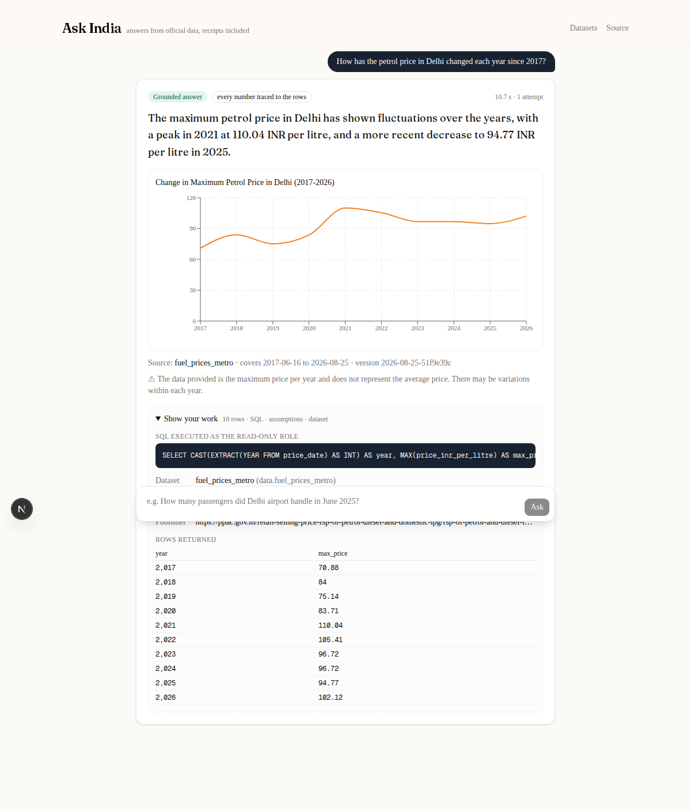

# Ask India

Plain-English questions about India, answered from official government datasets — and, next,
viral statistical claims checked against them. Every answer shows its work: the SQL that was
executed, the dataset it ran against, and that dataset's vintage.

**Live:** https://web.jollyocean-ec5e02b3.centralindia.azurecontainerapps.io (API:
https://api.jollyocean-ec5e02b3.centralindia.azurecontainerapps.io/health). Six real government
datasets; questions get a grounded answer with chart and receipts, claims get a verdict with the
official figure beside the claimed one. Read the caveat below before judging it by the live site.

**Status:** measured on the development stack (7B models on a GPU): **76.7 %** execution accuracy
on 60 gold questions, **93 %** recall on claims the data cannot settle. The public deployment runs
a 3B model on CPU because no hosted model is available on this subscription: it scores **40 %** on
the same questions, takes one to three minutes per answer (scale-to-zero cold starts included),
and — by design — refuses rather than guesses when its own answer fails the groundedness guard.
Details in [docs/DEPLOYMENT.md](docs/DEPLOYMENT.md) and [docs/EVALS.md](docs/EVALS.md).

**Last updated:** 2026-08-26, 18:50 IST



## What it does

- Turns a question like *"How has the petrol price in Delhi changed each year since 2017?"* into
  one PostgreSQL `SELECT`, runs it as a read-only database role, and writes the answer only from
  the rows that came back.
- Shows the receipt on every answer: executed SQL, dataset name, version (fetch date + content
  hash), coverage dates, assumptions the query writer made, and the rows.
- Refuses rather than guesses. Three things make that mechanical, not a matter of prompting:
  - **SQL admission guard** — `sqlglot` parses model output; anything but a single `SELECT` over
    the data schema is rejected before it reaches the database, which itself only grants the
    agent a `SELECT`-only, read-only-transaction role with a 10 s statement timeout.
  - **Groundedness guard** — a programmatic check extracts every numeral from the composed
    answer and requires it to be derivable from the result rows (or the question, SQL or
    citation). A failure triggers one regeneration, then the answer is refused.
  - **Fail-closed intake** — questions outside the catalogue get an explanation of what data
    would be needed, never a made-up number.

## Measured, not asserted

Two harnesses run against the real stack and gate every merge ([details](docs/EVALS.md)):

- **L1 execution accuracy** — 60 hand-written questions with gold SQL; the agent's rows must be
  equivalent to the gold rows. **76.7 %** overall (90 % on census and fuel prices, 60 % on
  rainfall and airport traffic). A 24-question subset blocks merges below the gate threshold.
- **L2 verdict accuracy** — 90 labelled claims, 60 of them generated from the data itself and
  mutated into Supported / Misleading / Contradicted. **83.3 %** overall; **93 % recall on
  Unverifiable**, the class that matters most.

## Checking a claim

Paste *"IndiGo carried more than 60% of India's domestic air passengers in 2024"* and the answer
is a verdict — Supported, Misleading, Contradicted or Unverifiable — with the claimed figure next
to the official one (61.93 %, from DGCA's carrier-wise statistics), the SQL, and the bands that
decided it (±10 % Supported; same direction within a factor of two Misleading). A claim the
catalogue cannot settle (*"India's GDP grew 8% last year"*) comes back Unverifiable with the
dataset that would be needed, before any query runs.

## The data

Six datasets fetched from their publishing ministries, validated, versioned and loaded
([details and what did not make v1](docs/DATASETS.md)):

| | Source | Coverage |
|---|---|---|
| Airline traffic | DGCA carrier-wise monthly statistics | Jan 2019 – Jul 2026 |
| Airport traffic | AAI airport-wise monthly passengers | Jan 2023 – Jun 2026 |
| Census 2011 | ORGI Primary Census Abstract, state and district | 1 Mar 2011 |
| Crops | DA&FW area, production and yield by state | 2021-22 – 2025-26 |
| Rainfall | IMD monthly rainfall by meteorological subdivision | 1901 – 2025 |
| Fuel prices | PPAC daily petrol and diesel prices, four metros | Jun 2017 – Aug 2026 |

Ingestion fails loud: a batch that fails validation is quarantined and recorded, never partially
loaded. Every row carries `dataset_version`; the catalogue (`/datasets`) reports each dataset's
current version and coverage.

## How it works

```
question ──▶ intake ──▶ schema retrieval (pgvector + keyword, RRF) ──▶ SQL generation (JSON contract)
         ──▶ sqlglot admission guard ──▶ execute as read-only role ──▶ classify error, retry ≤ 3
         ──▶ validate ──▶ compose answer + chart spec ──▶ groundedness guard ──▶ stream to UI
```

- `packages/agents` — LangGraph graph, prompts, guards, retriever, dictionaries, Langfuse tracing
- `packages/ingestion` — dataset loaders (`BaseLoader`: fetch → snapshot → parse → validate → load),
  validation, atomic persistence with audit rows
- `apps/api` — FastAPI: `POST /ask`, `POST /ask/stream` (Server-Sent Events per graph node),
  `GET /datasets`, `/health`, `/metrics` (Prometheus)
- `apps/web` — Next.js + Tailwind + shadcn/ui + Recharts
- `infra/k8s` — kustomize manifests applied to a local kind cluster; `infra/azure` — provisioning
  and rollout scripts for Azure Container Apps + PostgreSQL Flexible Server

Models are routed through LiteLLM: local Ollama (`qwen2.5-coder:7b` for SQL, `qwen2.5:7b-instruct`
for classification and prose) in development; the model ids are environment variables.

Why things are the way they are: [docs/DECISIONS.md](docs/DECISIONS.md). What data exists and
what was left out: [docs/DATASETS.md](docs/DATASETS.md). How it is deployed and why the live model
is weaker than the measured one: [docs/DEPLOYMENT.md](docs/DEPLOYMENT.md).

## Running it

Requires Docker, `uv`, Node 22 with `pnpm`, and Ollama.

```bash
cp .env.example .env                                   # fill in passwords and keys
docker compose --project-directory . -f infra/compose/compose.yaml up -d --wait
uv sync --all-packages --group dev
uv run python -m askindia_ingestion.migrate
scripts/dev_ollama.sh                                  # starts Ollama, pulls the two models
uv run scripts/ingest.py                               # fetch and load the six datasets (~2 min)
uv run scripts/index_dictionaries.py                   # embed the data dictionaries
uv run scripts/ask.py "Which state had the highest literacy rate in 2011?"
uv run uvicorn askindia_api.main:app --port 8000
cd apps/web && pnpm install && pnpm dev                # http://localhost:3000
```

Tests, lint and type checks (also run in CI on every pull request):

```bash
uv run pytest            # unit tests; add -m integration for tests against the local database
uv run ruff check . && uv run mypy
uv run scripts/check_dictionaries.py   # executes every exemplar query in the dictionaries
```

## License

MIT — see [LICENSE](LICENSE).
