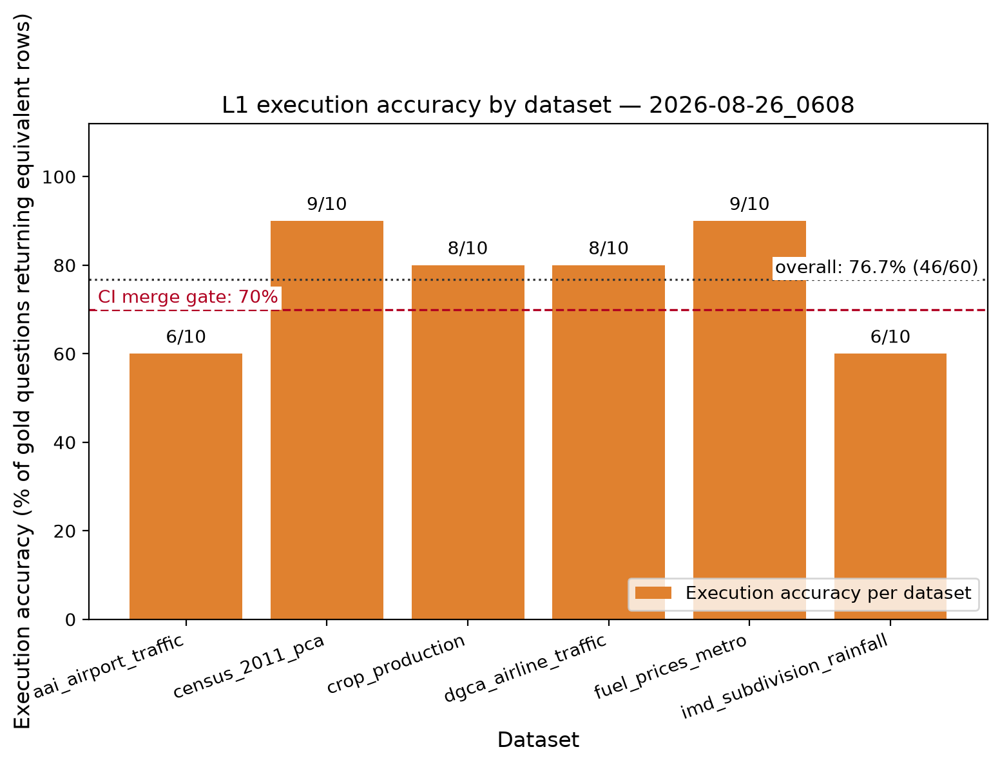
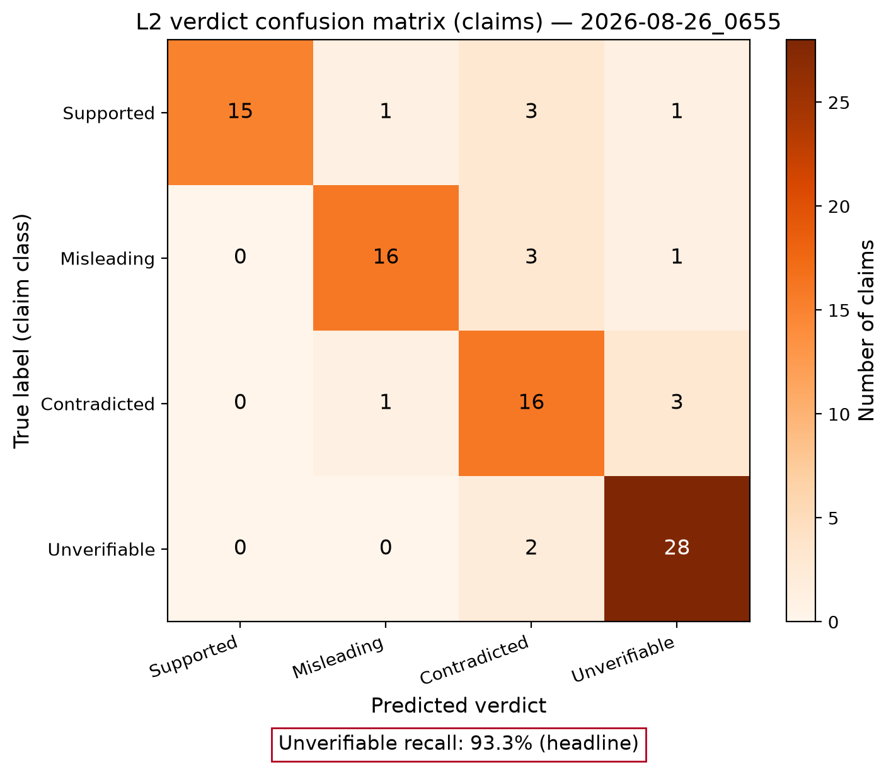

# Evaluation

Two automated harnesses run against the live development stack (Ollama `qwen2.5-coder:7b` for
SQL, `qwen2.5:7b-instruct` for classification and prose). Both compare *results*, never model
text: L1 compares the rows the agent's SQL returns with the rows of hand-written gold SQL; L2
compares the verdict on a claim with a label that was derived from the data itself.

## L1 — execution accuracy (60 gold questions, 2026-08-26)

| | correct / n | accuracy |
|---|---|---|
| **All** | **46 / 60** | **76.7 %** |
| Census 2011 | 9 / 10 | 90 % |
| Fuel prices | 9 / 10 | 90 % |
| Crop production | 8 / 10 | 80 % |
| DGCA airline traffic | 8 / 10 | 80 % |
| AAI airport traffic | 6 / 10 | 60 % |
| IMD rainfall | 6 / 10 | 60 % |

By complexity: single-value 100 %, join 100 %, ranking 88 %, group/trend 77 %, filter 71 %,
derived (percent change, ratios) 60 %. 91.7 % of questions received an answer; the rest failed
closed. Mean SQL attempts 1.15; median latency 9.8 s on a shared RTX 4500.



Where it fails: rainfall "normal" look-ups that return every year instead of one, derived
percentage changes computed against the wrong base, AAI airport names that drift between months,
and two-row answers where one row was expected. The per-question predictions are in
[evals/](evals/).

The merge gate (`.github/workflows/eval-gate.yml`) runs a 24-question stratified subset on every
pull request and fails below the threshold in the `L1_GATE_PCT` repository variable (65 % at the
time of writing, below the full-set number to absorb subset variance; ratcheted up as accuracy
improves).

## L2 — verdict accuracy (90 claims, 2026-08-26)

Claims: 60 generated from true facts (20 templates × Supported / Misleading / Contradicted
mutations that match the verdict bands), 20 hand-written statistical claims outside the
catalogue, 10 non-statistical or adversarial sentences.

| class | n | recall | precision |
|---|---|---|---|
| Supported | 20 | 75 % | 100 % |
| Misleading | 20 | 80 % | 89 % |
| Contradicted | 20 | 80 % | 67 % |
| **Unverifiable** | 30 | **93 %** | 85 % |

Overall 83.3 %. **Unverifiable recall is the headline**: a confident verdict on a claim the data
cannot settle is the one failure this product must not have. Two of thirty such claims received
a verdict — one about a year outside the dataset's coverage (now caught deterministically before
any query runs) and one about a measure that does not exist in the catalogue (a known gap:
measure existence is not yet verified).



## Groundedness

The guard is exercised in unit tests and live: with the composer's output tampered to inflate
every number by 7 %, the draft and its regeneration were both rejected and the request failed
closed. The guard's rejection count is exported as `askindia_guard_rejections_total`.

## Reproducing

```bash
uv run scripts/check_gold.py                 # every gold query executes
uv run python -m askindia_evals.l1           # writes results/evals/l1 + results/figures/l1
uv run python -m askindia_evals.l2           # writes results/evals/l2 + results/figures/l2
```
