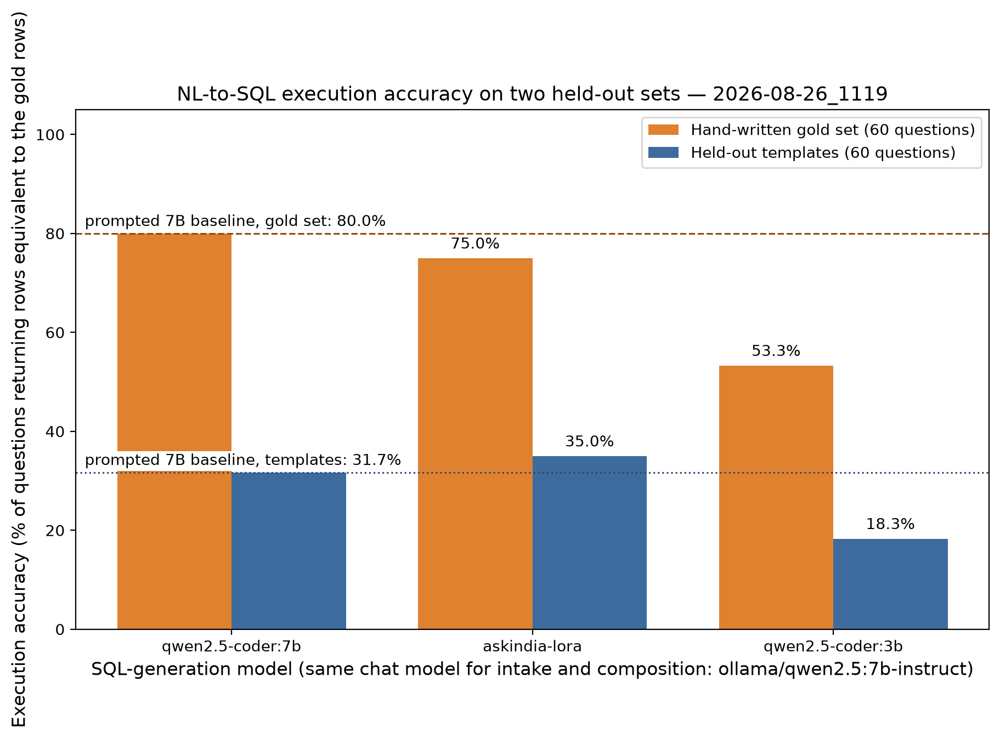

# Evaluation

Two automated harnesses run against the live development stack (Ollama `qwen2.5-coder:7b` for
SQL, `qwen2.5:7b-instruct` for classification and prose). Both compare *results*, never model
text: L1 compares the rows the agent's SQL returns with the rows of hand-written gold SQL; L2
compares the verdict on a claim with a label that was derived from the data itself.

## L1 — execution accuracy (60 gold questions, 2026-08-26)

| | correct / n | accuracy |
|---|---|---|
| **All** | **46 / 60** | **76.7 %** |
| Census 2011 | 9 / 10 | 90 % |
| Fuel prices | 9 / 10 | 90 % |
| Crop production | 8 / 10 | 80 % |
| DGCA airline traffic | 8 / 10 | 80 % |
| AAI airport traffic | 6 / 10 | 60 % |
| IMD rainfall | 6 / 10 | 60 % |

By complexity: single-value 100 %, join 100 %, ranking 88 %, group/trend 77 %, filter 71 %,
derived (percent change, ratios) 60 %. 91.7 % of questions received an answer; the rest failed
closed. Mean SQL attempts 1.15; median latency 9.8 s on a shared RTX 4500.


Where it fails: rainfall "normal" look-ups that return every year instead of one, derived
percentage changes computed against the wrong base, AAI airport names that drift between months,
and two-row answers where one row was expected. The per-question predictions are in
[evals/](evals/).

The merge gate (`.github/workflows/eval-gate.yml`) runs a 24-question stratified subset on every
pull request and fails below the threshold in the `L1_GATE_PCT` repository variable (65 % at the
time of writing, below the full-set number to absorb subset variance; ratcheted up as accuracy
improves).

## L2 — verdict accuracy (90 claims, 2026-08-26)

Claims: 60 generated from true facts (20 templates × Supported / Misleading / Contradicted
mutations that match the verdict bands), 20 hand-written statistical claims outside the
catalogue, 10 non-statistical or adversarial sentences.

| class | n | recall | precision |
|---|---|---|---|
| Supported | 20 | 75 % | 100 % |
| Misleading | 20 | 80 % | 89 % |
| Contradicted | 20 | 80 % | 67 % |
| **Unverifiable** | 30 | **93 %** | 85 % |

Overall 83.3 %. **Unverifiable recall is the headline**: a confident verdict on a claim the data
cannot settle is the one failure this product must not have. Two of thirty such claims received
a verdict — one about a year outside the dataset's coverage (now caught deterministically before
any query runs) and one about a measure that does not exist in the catalogue (a known gap:
measure existence is not yet verified).


## Groundedness

The guard is exercised in unit tests and live: with the composer's output tampered to inflate
every number by 7 %, the draft and its regeneration were both rejected and the request failed
closed. The guard's rejection count is exported as `askindia_guard_rejections_total`.

## Reproducing

```bash
uv run scripts/check_gold.py                 # every gold query executes
uv run python -m askindia_evals.l1           # writes results/evals/l1 + results/figures/l1
uv run python -m askindia_evals.l2           # writes results/evals/l2 + results/figures/l2
```

## P17 — does a fine-tuned small model beat prompting? (2026-08-26)

A LoRA adapter (r=16, QLoRA on a 4-bit Qwen2.5-Coder-7B-Instruct, 484 execution-verified training
pairs, 2 epochs, 15 minutes on one RTX 4500) is compared with the prompted base model and with the
3B model that runs in production. Only the SQL-generation model changes between rows: intake and
composition use `qwen2.5:7b-instruct` throughout, and the scorer is the same result-equivalence
check used everywhere else.

Two held-out sets, because they measure different things:

- **Hand-written gold set (60)** — the L1 questions, written by hand before any training data
  existed. No template that produced training data resembles them.
- **Held-out templates (60)** — questions from templates whose *entire* family was excluded from
  training, phrased tersely ("Airport with maximum domestic passengers in 2026-02?"). This is the
  in-domain generalisation test.

| model | gold set (60) | held-out templates (60) | answered | attempts | p50 | p95 |
|---|---|---|---|---|---|---|
| prompted `qwen2.5-coder:7b` | **80.0 %** | 31.7 % | 90.0 % | 1.20 | 12.0 s | 19.8 s |
| **LoRA** `askindia-lora` (7B) | 75.0 % | **35.0 %** | 90.0 % | 1.15 | **8.1 s** | **14.2 s** |
| prompted `qwen2.5-coder:3b` (production) | 53.3 % | 18.3 % | 76.7 % | 1.32 | 8.9 s | 16.2 s |



**The LoRA does not win outright, and the table ships as it is.** It is 5 points *worse* on the
hand-written gold set and 3.3 points *better* on held-out templates, while cutting median latency
by a third (8.1 s vs 12.0 s) because it emits the JSON contract without preamble. The honest
reading: 484 pairs from 69 templates taught the model this schema's idioms and this output shape,
but the templates are narrower than the questions a person actually asks, so on hand-written
phrasing the adapter has traded a little generality for a lot of speed. Fine-tuning is not
carrying its weight yet at this data scale, and the production default stays the prompted model.

What would change the verdict, in the order I would try it: more phrasing diversity per template
(an LLM paraphrase pass, currently not implemented); training pairs harvested from real L1
failures rather than only from templates; and a larger held-out set so a 3-point gap is more than
noise — at n=60, a 5-point difference is about three questions.

Reproduce:

```bash
uv run python -m askindia_training.build_dataset --out results/training/pairs.jsonl
uv run --extra train python -m askindia_training.train_qlora --pairs results/training/pairs.jsonl --out results/training/adapter-v1
bash packages/training/src/askindia_training/register_adapter.sh results/training/adapter-v1/final askindia-lora
uv run python -m askindia_training.benchmark --models ollama/qwen2.5-coder:7b,ollama/askindia-lora,ollama/qwen2.5-coder:3b
```
